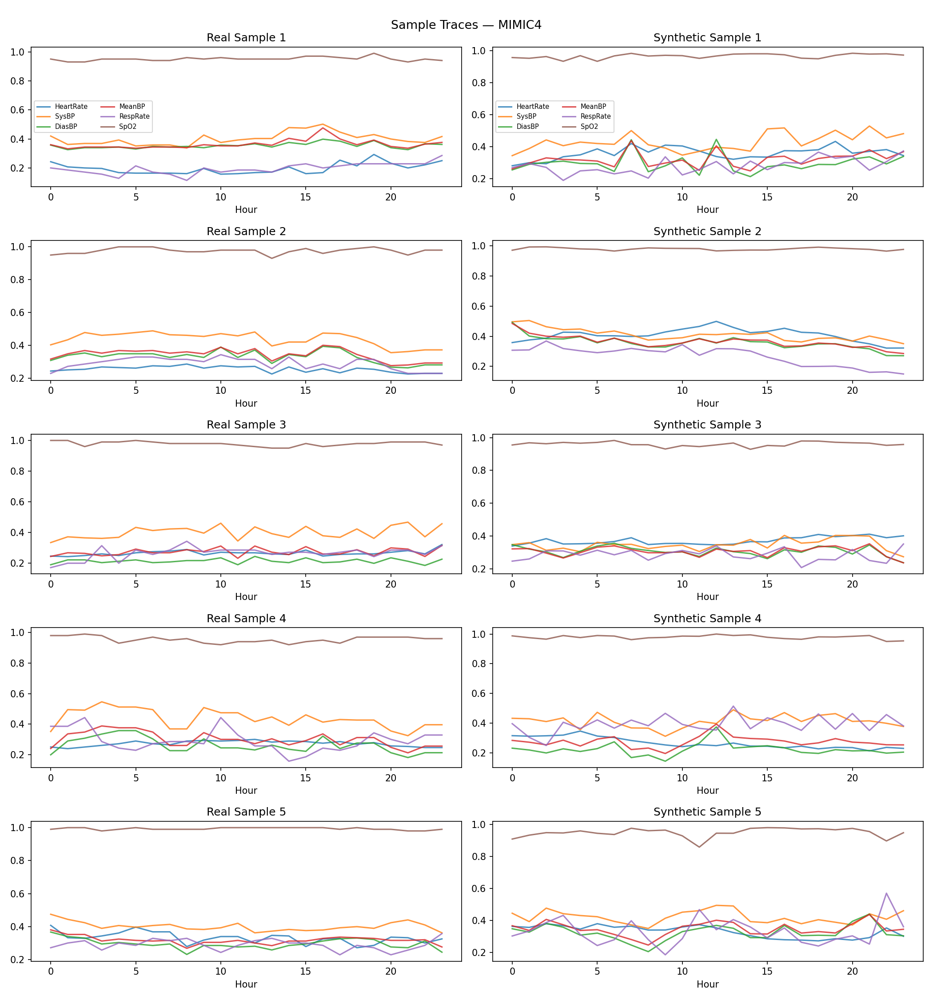
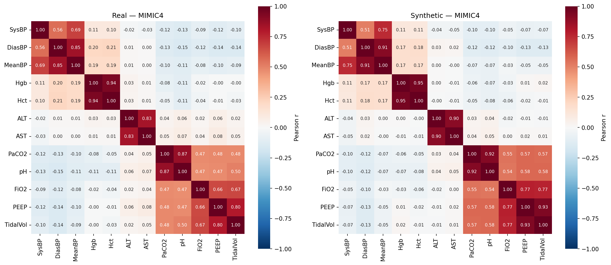

# Synthetic EHR Time-Series Generation with Diffusion Models


A denoising diffusion model (DDPM) that generates **synthetic ICU patient time-series** — jointly modelling 35 clinical variables **and** their missingness pattern — so researchers can build clinical ML models without touching real patient records.

Evaluated on three real-world ICU datasets (**147K+ patient stays**) across realism, downstream utility, and privacy, with 10 independent runs per dataset.

<p align="center">
  
</p>

---

## Results

Mean of 10 independent runs per dataset (`results/metrics_v2.csv`).

| Dataset | Stays | Privacy — NNAA ↓ | Utility — TSTR/TRTR ↓ (1.0 = parity) | MMD ↓ | Discriminative score ↓ |
|---|---|---|---|---|---|
| MIMIC-III | 43,781 | **0.004** | **1.14** | 0.024 | 0.28 |
| MIMIC-IV | 73,902 | **0.006** | **1.11** | 0.023 | 0.36 |
| eICU | 30,336 | **0.008** | **1.27** | 0.073 | 0.23 |

- **Privacy:** NNAA close to 0 means synthetic records are no closer to training patients than to unseen patients — no sign of memorisation.
- **Utility:** a GRU forecaster that predicts the next hour's vitals and labs, trained on synthetic data and tested on real data (TSTR), reaches an MAE within 11–27% of the same model trained on real data (TRTR).
- **Temporal realism:** mask-fill generation closed **65–76%** of the temporal-structure gap between real and synthetic data.

<p align="center">
  
</p>

---

## How it works

```
Real ICU stay (24 h × 35 features)  ──►  forward diffusion
   Gaussian noise  → values   X̃ᵗ
   Bernoulli noise → mask     M̃ᵗ
                    │
   [X̃ᵗ ‖ M̃ᵗ ‖ t_emb]  (105-dim per hour)
                    │
   Bidirectional GRU denoiser (2 layers, hidden 256)
        ├── noise head  → ε̂   (continuous values)
        └── mask head   → M̂   (which values were actually measured)
```

Key design choices:

- **Joint value + missingness modelling.** Real EHRs are mostly missing; the model learns *what* was measured as well as *the value*, via an independent mask head trained with BCE.
- **Cross-feature correlation loss.** A covariance-matching term (λ = 0.1) keeps physiologically linked variables (e.g. haemoglobin ↔ haematocrit) realistic, not just each variable on its own.
- **Mask-fill at generation.** The generated mask forward-fills synthetic values exactly the way real data was preprocessed.
- **35 features** — 7 vitals + 28 labs — a wider feature set than most synthetic-EHR work.

Training objective: `L = L_noise(MSE) + L_mask(BCE) + 0.1 · L_corr`

---

## Evaluation suite

| Axis | Metric | Code |
|---|---|---|
| Realism | Discriminative score (GRU real-vs-synthetic classifier), MMD, t-SNE / PCA / UMAP | `evaluation/discriminative.py`, `evaluation/mmd.py`, `evaluation/visualization.py` |
| Utility | Train-on-Synthetic / Test-on-Real vs Train-on-Real | `evaluation/predictive_v2.py` |
| Privacy | Nearest-neighbour adversarial accuracy (NNAA) | `evaluation/privacy_v2.py` |
| Robustness | Per-feature and coupled-pair diagnostics | `evaluation/robustness_diagnostics.py` |

---

## Project structure

```
├── train_timediff.py        # training entry point
├── generate.py              # sampling + mask-fill post-processing
├── evaluate.py              # full evaluation → results/metrics_v2.csv + plots
├── run_full_pipeline.ipynb  # end-to-end notebook
├── models/timediff/         # brnn.py (denoiser), diffusion.py, ema.py
├── data/loaders/            # mimic3.py, mimic4.py, eicu.py preprocessing
├── evaluation/              # metrics listed above
├── configs/                 # one YAML per dataset
└── results/                 # metric tables, heatmaps, plots
```

## Quick start

```bash
pip install -r requirements.txt

# 1. Preprocess (requires credentialed PhysioNet access — see note below)
python data/loaders/mimic3.py --raw_dir data/raw/mimic3 --out_dir data/processed

# 2. Train
python train_timediff.py --config configs/timediff_mimic3.yaml --run_name timediff_mimic3

# 3. Generate
python generate.py --model timediff --config configs/timediff_mimic3.yaml \
  --checkpoint results/timediff_mimic3/best.pt --n_samples 10000 \
  --output data/synthetic/timediff_mimic3.npy --data_dir data/processed

# 4. Evaluate
python evaluate.py --dataset mimic3 --model timediff \
  --synthetic data/synthetic/timediff_mimic3.npy --data_dir data/processed --device cuda
```

> **Data access.** MIMIC-III, MIMIC-IV and eICU require credentialed access via [PhysioNet](https://physionet.org/). To comply with the PhysioNet data use agreement, this repository contains **no patient data, no model checkpoints and no generated samples** — only code, configs and aggregate results.

---

**Tech:** Python · PyTorch · NumPy · pandas · scikit-learn · Weights & Biases · YAML configs

Built with [Yagni Patel](https://github.com/YagniPatel) · MIT License
